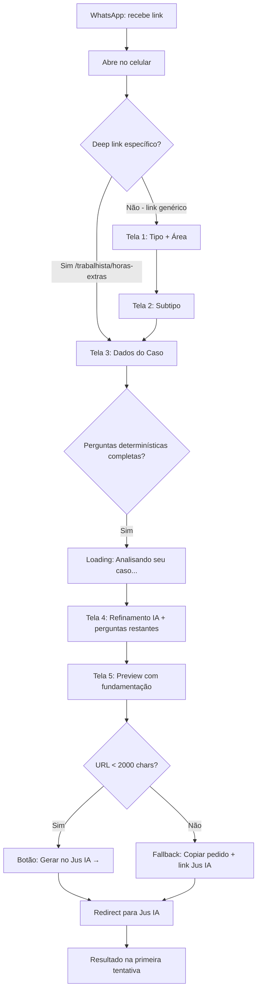
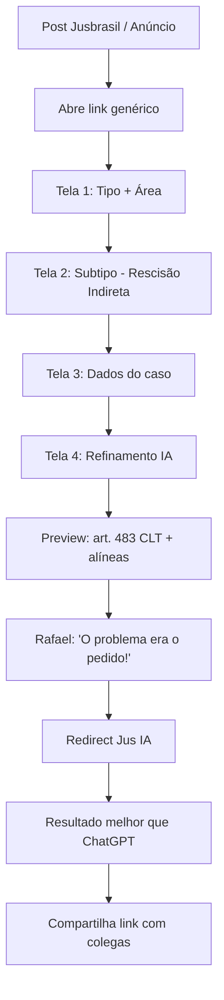
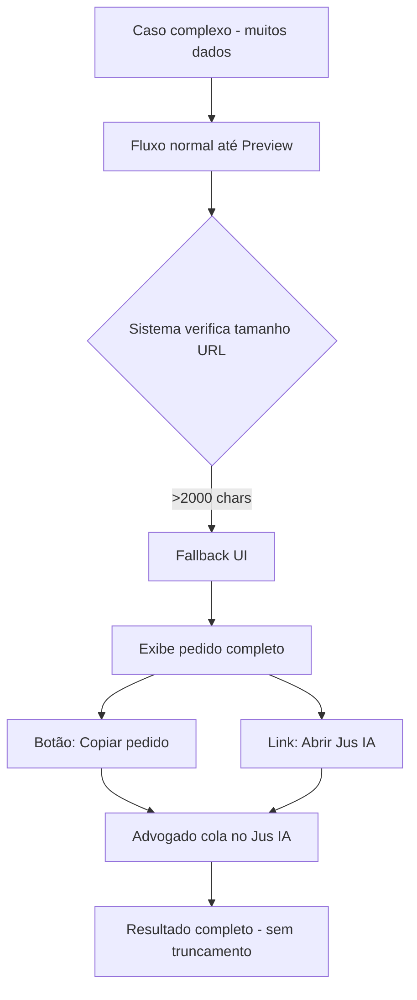
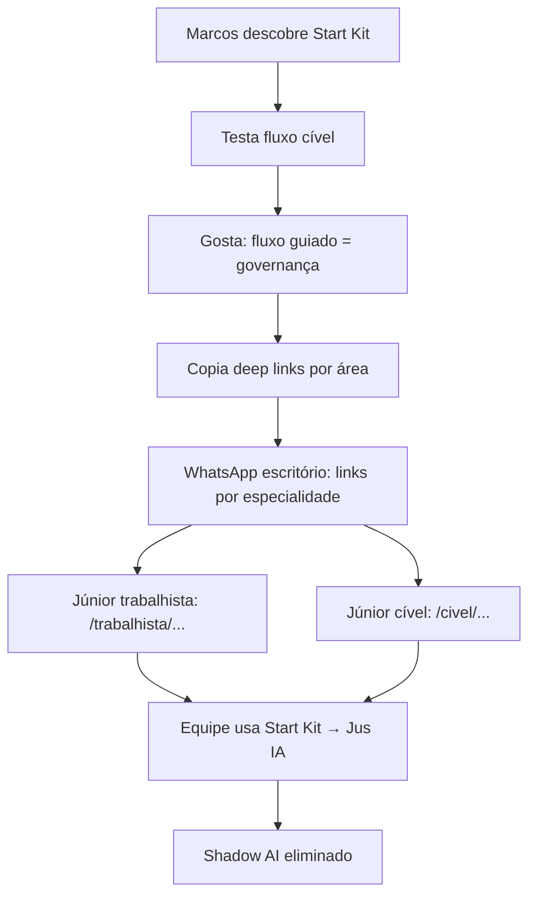

# UX Design Specification - Jus IA Start Kit

**Author:** Gabriel Vaz
**Date:** 2026-03-08

---

## Executive Summary

### Project Vision

O Jus IA Start Kit é um assistente web que funciona como "tradutor de intenção jurídica": o advogado responde perguntas sobre seu caso em linguagem jurídica e é redirecionado ao Jus IA com um pedido otimizado pronto para gerar resultado de alta qualidade na primeira tentativa. A experiência abstrai completamente o conceito de prompt engineering — o advogado nunca vê um prompt, nunca edita código, nunca precisa saber como falar com IA.

A mecânica central é um fluxo híbrido: perguntas estruturadas (determinísticas) coletam dados do caso, seguidas de refinamento contextual por IA (não-determinístico) que captura nuances. O resultado é montado nos bastidores e entregue ao Jus IA via URL parametrizada ou fallback copy-paste.

### Target Users

**Dra. Carla — A Resistente Pragmática** (primária): Advogada autônoma, 42 anos, trabalhista. Nunca usou IA, gasta 2-3h por petição. Precisa de resultado comprovável na primeira tentativa, sem investir tempo aprendendo. Abre o Start Kit no celular entre audiências, via link de WhatsApp.

**Dr. Rafael — O Sobrecarregado Digital** (primário): Advogado autônomo, 29 anos, usa ChatGPT diariamente mas itera 3-5 vezes por petição. Sabe que IA pode ajudar mas não sabe formular o pedido certo. Precisa de um atalho que elimine o ciclo de tentativa-e-erro.

**Dr. Marcos — O Dono de Escritório** (secundário): Sócio, 50 anos, equipe usa ChatGPT sem governança (Shadow AI). Precisa padronizar o uso de IA na equipe sem supervisionar cada pedido. Deep links por área funcionam como ferramenta de governança.

### Key Design Challenges

1. **Dois perfis opostos de confiança**: a mesma interface precisa transmitir segurança e credibilidade para quem nunca usou IA (Carla) e eficiência/velocidade para quem já usa diariamente (Rafael).
2. **Abstração total do prompt engineering**: linguagem 100% jurídica, zero vocabulário técnico de IA. O produto deve parecer "ferramenta jurídica", não "ferramenta de IA".
3. **Mobile-first entre audiências**: fluxo completável em <5 min com uma mão, em tela pequena, com conexão potencialmente instável.
4. **Continuidade em MPA**: cada etapa é um page load — o progresso precisa ser visualmente claro e a experiência fluida, sem sensação de formulário burocrático.

### Design Opportunities

1. **"Momento aha" no preview**: a tela que mostra o pedido montado com fundamentação jurídica específica é o ponto de materialização do valor — oportunidade de criar confiança, surprise-and-delight, e conversão.
2. **Educação implícita via perguntas**: o fluxo ensina o advogado o que é relevante para um bom pedido sem que ele perceba que está aprendendo — o UX pode amplificar esse efeito.
3. **WhatsApp como experiência de entrada**: OG tags, deep links por área, experiência de "abrir link e já estar no fluxo certo" — a primeira impressão é no mobile via WhatsApp.

---

## Core Experience Definition

### Core User Action

O advogado responde perguntas sobre seu caso e recebe um pedido otimizado pronto para o Jus IA. Do ponto de vista emocional, existem apenas **dois momentos**: "estou respondendo perguntas sobre meu caso" e "recebi meu pedido pronto". Tudo entre eles deve ser invisível.

### Experience Principles

1. **Transição IA invisível**: Perguntas geradas por IA devem ser indistinguíveis das perguntas estruturadas. Quando possível, perguntas da IA devem oferecer opções pré-definidas (seleção), não campos de texto abertos. Quando texto livre for necessário, usar placeholders específicos e contextuais (ex: "Ex: não pagava horas extras e exigia trabalho aos sábados") — nunca campos genéricos vazios. O advogado não deve perceber que mudou de fase determinística para não-determinística.

2. **Velocidade é respeito — quantificada**: O fluxo inteiro (primeiro toque → botão "Gerar no Jus IA") deve ter **no máximo 4-5 telas de perguntas**. Se o advogado conta mais de 5 etapas no indicador de progresso, já parece longo. Perguntas devem ser agrupadas agressivamente por "momento mental" — na mesma tela, perguntas que pertencem ao mesmo contexto decisório (ex: "Regime de Trabalho" + jornada contratual se CLT). Perguntas de momentos mentais diferentes (ex: "Há registro de ponto?" vs "Existem testemunhas?") vão em telas separadas.

3. **Um momento mental por tela**: Cada tela tem uma decisão principal, com sub-perguntas relacionadas agrupadas abaixo. Isso reduz page loads em MPA (de 8-11 para 4-5) mantendo clareza cognitiva. Progressive enhancement com JavaScript para transições sem reload quando disponível.

4. **Preview = fundamentação jurídica como contrato de confiança**: O valor do preview não é mostrar o prompt — é mostrar **artigos, súmulas e jurisprudência** que o advogado reconhece. Quando Dra. Carla vê "art. 59 da CLT, Súmula 85 do TST", pensa: "isso eu conheço, isso é real". A fundamentação jurídica visível é o momento de conversão — a linguagem dela validando a máquina.

5. **Linguagem 100% jurídica**: Zero vocabulário técnico de IA. O produto parece "ferramenta jurídica", não "ferramenta de IA".

### Critical Success Moments

1. **Primeira pergunta (<3 segundos)**: O advogado abre o link (WhatsApp, deep link) e em menos de 3 segundos está respondendo a primeira pergunta relevante sobre seu caso. Sem onboarding, sem cadastro, sem explicação.

2. **Preview com fundamentação jurídica**: A tela que mostra o pedido montado com artigos específicos da CLT e súmulas do TST. Este é o momento de materialização do valor — "a máquina sabe o que é relevante pro meu caso".

3. **Redirecionamento ao Jus IA**: O clique final que leva ao Jus IA com tudo pronto. O resultado gerado na primeira tentativa valida toda a experiência anterior.

4. **Momento de recuperação**: Quando o advogado erra uma resposta ou quer voltar. O botão de voltar deve ser visível e óbvio. O browser back deve funcionar perfeitamente em MPA. Voltar **nunca** pode perder respostas já dadas nas telas seguintes. Confiança quebra quando o advogado sente que perdeu trabalho.

### Effortless Interactions

- **Toque único por decisão**: Cada pergunta deve ser respondível com um toque (seleção, toggle, chip). Texto livre é exceção, não regra.
- **Agrupamento por momento mental**: 2-3 perguntas relacionadas por tela, máximo 4-5 telas no fluxo completo.
- **Placeholders contextuais**: Quando texto livre for necessário, exemplos específicos guiam a resposta (ex: "Ex: demissão sem justa causa em 15/01/2026").
- **Progresso visual claro**: Indicador de progresso mostra 4-5 etapas — nunca mais que isso.

---

## Desired Emotional Response

### Primary Emotional Goals

**Para Dra. Carla (nunca usou IA):** Segurança → Surpresa → Confiança. Ela precisa sentir que está no controle (perguntas familiares sobre seu caso), ser surpreendida pelo resultado (preview com fundamentação jurídica que ela reconhece), e sair confiante de que a ferramenta funciona.

**Para Dr. Rafael (usa IA mas itera):** Alívio → Revelação → Empoderamento. Ele precisa sentir alívio ao ver que as perguntas certas estão sendo feitas (não precisa pensar no prompt), revelação ao entender que o problema era o pedido e não a ferramenta, e empoderamento ao ter um caminho repetível.

**Para Dr. Marcos (dono de escritório):** Controle → Praticidade → Tranquilidade. Precisa sentir que tem controle sobre como a equipe usa IA (deep links por área), que a solução é prática (sem admin panel, sem configuração), e tranquilidade de que a qualidade está garantida (base verificada do Jus IA).

### Emotional Journey Mapping

| Momento | Emoção Desejada | Emoção a Evitar | Mecanismo UX |
|---------|----------------|-----------------|--------------|
| **Abrir o link** | Curiosidade confiante | Desconfiança, "mais uma ferramenta" | Linguagem jurídica desde o primeiro pixel, sem menção a IA/prompt |
| **Primeira pergunta** | "Isso é sobre o meu caso" | "Estão pedindo meus dados" | Pergunta relevante e específica, não genérica |
| **Durante o fluxo** | Fluidez, progresso | Tédio, burocracia, "formulário do governo" | Toque único, progresso visual, 4-5 telas máximo |
| **Pergunta da IA** | "Boa pergunta, não tinha pensado nisso" | "Por que está perguntando isso?" | Pergunta contextual que demonstra inteligência sem parecer aleatória |
| **Loading da IA** | Expectativa positiva | Ansiedade, impaciência | Indicador com microcopy: "Analisando seu caso..." (não "Processando...") |
| **Preview** | Surpresa + validação | Desconfiança do resultado | Fundamentação jurídica visível (artigos, súmulas) — a linguagem do advogado |
| **Redirect** | Satisfação, "funcionou!" | Medo de perder o que foi feito | Confirmação visual antes do redirect, opção de copiar |
| **Resultado no Jus IA** | "Por que não fiz isso antes?" | "Preciso refazer tudo" | Prompt bem construído = resultado na primeira tentativa |

### Micro-Emotions

**Críticas para o sucesso:**
- **Confiança > Ceticismo**: Cada elemento visual deve reforçar credibilidade institucional (Jusbrasil como âncora de confiança)
- **Competência > Confusão**: O advogado nunca deve se perguntar "o que devo fazer agora?" — a próxima ação é sempre óbvia
- **Progresso > Estagnação**: Cada toque leva visivelmente adiante — barra de progresso + feedback imediato

**A evitar ativamente:**
- **Ansiedade**: "Estou colocando dados do meu cliente aqui?" → Microcopy: "Seus dados não são armazenados"
- **Frustração**: "Perdi o que já respondi" → Estado preservado no browser back
- **Condescendência**: "Isso é para quem não sabe usar IA" → Linguagem de profissional para profissional

### Emotion-Design Connections

| Emoção Desejada | Decisão de UX |
|-----------------|---------------|
| Segurança | Sem login, sem dados retidos, disclaimer visível mas não invasivo |
| Competência | Microcopy em linguagem jurídica, perguntas que demonstram expertise do sistema |
| Velocidade | Toque único, agrupamento por momento mental, indicador de progresso compact |
| Surpresa positiva | Preview com artigos/súmulas específicos — "a máquina sabe direito" |
| Controle | Botão voltar visível, browser back funcional, opção de copiar antes do redirect |

### Emotional Design Principles

1. **Credibilidade antes de tudo**: A primeira impressão determina se Carla continua ou fecha. Cada pixel deve comunicar "ferramenta jurídica profissional", não "startup de IA".
2. **Inteligência demonstrada, não declarada**: Não dizer "nossa IA é inteligente" — mostrar fazendo perguntas que o advogado reconhece como relevantes.
3. **Progresso como recompensa**: Cada resposta leva visivelmente ao resultado — o advogado sente que está construindo algo, não preenchendo formulário.
4. **Transparência sem sobrecarga**: "Seus dados não são armazenados" uma vez, discreto. Não repetir em cada tela.

---

## UX Pattern Analysis & Inspiration

### Inspiring Products Analysis

**1. WhatsApp — Experiência de entrada e compartilhamento**
- O que faz bem: preview de links (OG tags) cria primeira impressão antes do clique. Compartilhar é o gesto mais natural. A maioria dos advogados brasileiros (90%) usa profissionalmente.
- UX lesson: O link compartilhado precisa ter preview rico e auto-explicativo. O advogado que recebe deve entender o valor antes de clicar.

**2. iFood / Rappi — Fluxo de seleção em poucos toques**
- O que faz bem: Categoria → Subcategoria → Customização em 3-4 telas. Decisões por toque único. Progresso visível. Funciona perfeitamente em mobile com uma mão.
- UX lesson: Nosso fluxo (Tipo de tarefa → Área → Subtipo → Perguntas → Preview) deve ter a mesma fluência. Cada tela uma decisão principal. Chips e seleções, não campos de texto.

**3. Nubank — Confiança em mobile para produto financeiro**
- O que faz bem: Tom profissional mas acessível. Linguagem clara sem jargão técnico financeiro. Feedback visual imediato em cada ação. Funciona como "ferramenta financeira" sem parecer "app de banco".
- UX lesson: O Start Kit deve parecer "ferramenta jurídica" assim como o Nubank parece "ferramenta financeira" — sem parecer que é IA por trás.

**4. Typeform — Fluxo conversacional um passo por vez**
- O que faz bem: Uma pergunta por tela cria sensação de conversa, não formulário. Transições suaves. Progresso visual. Lógica condicional que pula perguntas irrelevantes.
- UX lesson: O agrupamento por "momento mental" é nossa versão otimizada deste padrão — conversacional mas mais eficiente que uma pergunta por tela.

### Transferable UX Patterns

**Navigation Patterns:**
- **Seleção por chips (iFood)**: Para tipo de tarefa, área do direito, subtipo — toque único, visual claro
- **Stepper linear (Nubank onboarding)**: Indicador de progresso 4-5 etapas, sempre visível no topo
- **Deep link direto (WhatsApp)**: Entrada no fluxo exato via URL — pula seleção inicial quando possível

**Interaction Patterns:**
- **Progressive disclosure (Typeform)**: Mostrar perguntas condicionais apenas quando relevantes (ex: jornada contratual só aparece se CLT)
- **Chip selection (Material Design)**: Respostas pré-definidas como chips tocáveis, sem dropdown
- **Inline validation (Nubank)**: Feedback imediato ao responder, sem esperar submit

**Feedback Patterns:**
- **Skeleton loading (Nubank)**: Durante chamada LLM, mostrar estrutura da próxima tela com shimmer
- **Microcopy contextual (Typeform)**: Texto helper que guia sem explicar demais
- **Success celebration (Duolingo)**: Micro-animação no preview para marcar o "momento aha"

### Anti-Patterns to Avoid

- **Formulário longo com scroll**: Advogado entre audiências não vai scrollar. Uma tela = uma decisão.
- **Dropdown menus em mobile**: Dropdowns são péssimos em touch. Sempre chips ou radio buttons.
- **Loading genérico ("Carregando...")**: Não comunica valor. Usar microcopy contextual ("Analisando seu caso...").
- **Explicação antes da ação**: Não mostrar tutorial ou onboarding. A primeira tela já é a primeira pergunta.
- **Linguagem de chatbot**: "Olá! Sou um assistente de IA..." — este framing afasta a Dra. Carla imediatamente.

### Design Inspiration Strategy

**Adotar diretamente:**
- Chip selection para todas as perguntas de seleção (iFood/Material)
- Stepper linear compact no topo (Nubank)
- OG tags ricas para preview no WhatsApp

**Adaptar ao contexto:**
- Progressive disclosure do Typeform → agrupamento por momento mental (2-3 perguntas/tela)
- Tom conversacional do Typeform → linguagem jurídica profissional
- Celebração do Duolingo → micro-feedback sutil no preview (profissional, não gamificado)

**Evitar explicitamente:**
- Chatbot UI com balões de conversa — parece IA, afasta Carla
- Onboarding/tutorial antes do fluxo — barra de entrada
- Multi-step wizard com 8+ etapas — parece burocracia

---

## Design System Foundation

### Design System Choice

**Decisão: Tailwind CSS + componentes custom leves (sem framework de componentes)**

### Rationale for Selection

1. **MPA mobile-first**: Tailwind funciona perfeitamente com server-rendered HTML — sem dependência de JavaScript framework pesado
2. **Performance**: CSS utilitário gera bundles mínimos. Cada page load carrega apenas o CSS usado — crítico para 3G entre audiências
3. **Customização total**: Sem overhead de Material Design ou Bootstrap que traria componentes desnecessários e visual genérico
4. **Boring technology**: Tailwind é estável, bem documentado, ampla comunidade. Sem risco de lock-in ou abandono
5. **Velocidade de desenvolvimento**: Utility-first permite iterar rapidamente no MVP sem criar sistema de design complexo

### Implementation Approach

- **Base**: Tailwind CSS v4+ com configuração customizada de design tokens
- **Componentes**: HTML semântico + classes Tailwind. Componentes server-side (templates/partials), não client-side
- **JavaScript**: Minimal — progressive enhancement para interações que melhoram a experiência (transições, validação inline) mas não são obrigatórias
- **Ícones**: Heroicons (já integrado com Tailwind) para consistência visual

### Customization Strategy

- Design tokens customizados no Tailwind config: cores, tipografia, espaçamento, border-radius
- Componentes reutilizáveis via templates/partials do backend (não React/Vue/Svelte)
- Preflight reset + base styles para consistência cross-browser
- Sem tema escuro no MVP — foco em uma experiência visual coesa

---

## Core User Experience

### Defining Experience

**"Responda sobre seu caso e receba um pedido jurídico otimizado pronto para gerar resultado na primeira tentativa."**

Este é o equivalente do Start Kit ao "Swipe to match" do Tinder — a interação que, se perfeita, define o produto. O advogado descreve seu caso respondendo perguntas e recebe um artefato jurídico (pedido otimizado) que funciona de primeira. A mágica é: as perguntas certas extraem as informações certas, sem que o advogado precise saber o que é relevante para um bom prompt.

### User Mental Model

**O que o advogado espera:** Uma consulta estruturada. Semelhante a quando um colega mais experiente pergunta sobre o caso antes de ajudar: "Qual o vínculo?", "Quanto tempo?", "Tem registro de ponto?". O advogado entende perguntas — faz isso todo dia com clientes.

**O que NÃO espera:** Um chat com IA. Não espera campo de texto livre para "descrever seu caso". Não espera ter que saber o que é relevante. Não espera vocabulário técnico de IA.

**Modelo mental correto a reforçar:** "Estou consultando um sistema especialista que sabe fazer as perguntas certas sobre meu tipo de caso."

**Workarounds atuais:**
- Carla: escreve petição do zero, 2-3 horas. Copia modelo de colega.
- Rafael: copia prompts do Google, itera 3-5x no ChatGPT. Gasta 1h tentando.
- Marcos: equipe usa ChatGPT sem padrão, resultados inconsistentes.

### Success Criteria

| Critério | Indicador | Meta |
|----------|-----------|------|
| "Isso funciona de primeira" | Resultado no Jus IA sem reformulação | >70% |
| "Foi rápido" | Tempo do primeiro toque ao redirect | <5 min |
| "Não precisei aprender nada" | Conclusão sem abandono | >60% |
| "Vou mandar pra colega" | Tráfego por referral/WhatsApp | >30% |
| "Não perdi nada ao voltar" | Estado preservado no browser back | 100% |

### Novel UX Patterns

O Start Kit combina padrões estabelecidos de forma inovadora:

**Padrão estabelecido (familiar):** Fluxo de seleção tipo e-commerce (categoria → subcategoria → detalhes). O advogado já faz isso no iFood e Nubank.

**Inovação invisível:** A transição de perguntas determinísticas para perguntas geradas por IA. O advogado não percebe que mudou de fase — as perguntas da IA são renderizadas identicamente às estruturadas (chips, seleções, placeholders contextuais).

**Padrão novo que precisa de validação:** O preview como "contrato de confiança" — mostrar fundamentação jurídica antes do redirect. Este é o ponto de risco: se o preview for confuso ou parecer "prompt", quebra a confiança. Se mostrar artigos/súmulas reconhecíveis, cria o "momento aha".

### Experience Mechanics

**1. Initiation:**
- Advogado recebe link via WhatsApp, post do Jusbrasil, ou acesso direto
- Deep link pode pré-selecionar área (ex: `/trabalhista/horas-extras` pula seleção inicial)
- Se link genérico: primeira tela = "O que você precisa?" com chips de tipo de tarefa

**2. Interaction (4-5 telas):**
- **Tela 1 — Tipo + Área**: "O que você precisa?" [Petição Inicial] [Contestação] [Pesquisa] + Área do direito [Trabalhista] [Cível] (agrupados se deep link não pré-selecionou)
- **Tela 2 — Subtipo**: Subtipos da área selecionada como chips (ex: [Horas Extras] [Rescisão Indireta] [Dano Moral])
- **Tela 3 — Dados do caso**: Perguntas estruturadas agrupadas por momento mental (empregador PJ/PF, regime, jornada, período — todas no mesmo contexto "relação de trabalho")
- **Tela 4 — Refinamento contextual**: Perguntas da IA + determinísticas restantes, renderizadas identicamente (registro de ponto, testemunhas, pagamento parcial). Loading state: "Analisando seu caso..."
- **Tela 5 — Preview + Redirect**: Pedido montado com fundamentação jurídica + botão "Gerar no Jus IA →"

**3. Feedback:**
- Barra de progresso no topo atualiza a cada avanço (4-5 steps)
- Seleção de chip: feedback visual imediato (cor + check)
- Loading IA: skeleton com shimmer + microcopy ("Analisando seu caso...")
- Preview: fundamentação jurídica destacada visualmente (badges com artigos/súmulas)

**4. Completion:**
- Preview mostra o pedido montado em linguagem jurídica (não o prompt raw)
- Fundamentação jurídica como badges clicáveis (art. 59 CLT, Súmula 85 TST)
- Botão primário: "Gerar no Jus IA →" (redirect via URL parametrizada)
- Se URL excede limite: fallback com "Copiar pedido" + link direto para Jus IA
- Microcopy: "Seus dados não são armazenados após o redirecionamento"

---

## Visual Design Foundation

### Color System

**Paleta primária — Alinhada com Jus IA brand:**

| Token | Cor | Uso |
|-------|-----|-----|
| `primary` | Verde escuro (#007A5F) | Ações primárias, botões, CTAs, header — cor principal do Jus IA |
| `primary-light` | Verde médio (#009B78) | Hover states |
| `primary-dark` | Verde escuro (#005C47) | Active/pressed states |
| `accent` | Dourado/âmbar (#D4A843) | Badges de fundamentação jurídica — diferenciador do Start Kit |
| `surface` | Branco (#FFFFFF) | Background de cards e áreas de conteúdo |
| `background` | Cinza muito claro (#F8F9FA) | Background geral das páginas |
| `text-primary` | Azul acinzentado (#5C6F8A) | Texto principal, corpo — padrão Jus IA |
| `text-dark` | Quase preto (#0F172A) | Headings, texto enfático — padrão Jusbrasil |
| `text-secondary` | Cinza médio (#6B7280) | Texto auxiliar, placeholders |
| `border` | Cinza azulado (#B3C0D0) | Bordas de cards, inputs, botões secondary — padrão Jus IA |

**Paleta semântica:**

| Token | Cor | Uso |
|-------|-----|-----|
| `success` | Verde Jusbrasil (#7AB441) | Confirmação, progresso completo — cor do logo Jusbrasil |
| `warning` | Âmbar (#D97706) | Atenção, fallback copy-paste |
| `error` | Vermelho (#DC2626) | Erros de validação |
| `info` | Azul Jusbrasil (#378CC8) | Dicas, microcopy informativo — cor do logo Jusbrasil |

**Rationale:** Verde (#007A5F) como primary alinha o Start Kit com a identidade visual do Jus IA — continuidade visual natural quando o advogado é redirecionado. O dourado (#D4A843) é mantido exclusivamente para badges de fundamentação jurídica, criando um diferenciador visual do Start Kit que não existe no Jus IA. As cores semânticas (success verde, info azul) remetem ao logo Jusbrasil, reforçando a conexão com o ecossistema.

**Acessibilidade:** Contraste mínimo 4.5:1 para texto normal, 3:1 para texto grande. Primary (#007A5F) sobre branco = ratio 5.9:1 (passa AA). Text-dark (#0F172A) sobre branco = ratio 16.6:1 (passa AAA).

**Componentes (alinhados com Jus IA):**
- **Button Primary**: Background `#007A5F`, texto branco, border-radius 8px, shadow `rgba(25, 52, 102, 0.04) 0px 2px 4px`
- **Button Secondary**: Background branco, texto `#007A5F`, borda `#B3C0D0`, border-radius 8px

### Typography System

**Typeface:**
- **Primary (headings)**: Inter — clean, profissional, excelente legibilidade em mobile. Sem serifa para modernidade sem perder seriedade.
- **Body text**: Inter — mesma família para consistência. Pesos variados para hierarquia.
- **Fallback**: system-ui, -apple-system, Segoe UI, Oxygen, Ubuntu, Cantarell, Open Sans, Helvetica Neue, sans-serif (stack Jus IA)

**Type scale (mobile-first):**

| Token | Size | Weight | Line Height | Uso |
|-------|------|--------|-------------|-----|
| `heading-1` | 24px (1.5rem) | 700 | 1.3 | Título da página |
| `heading-2` | 20px (1.25rem) | 600 | 1.35 | Seções |
| `heading-3` | 16px (1rem) | 600 | 1.4 | Subtítulos |
| `body` | 16px (1rem) | 400 | 1.5 | Texto principal |
| `body-small` | 14px (0.875rem) | 400 | 1.5 | Microcopy, helpers |
| `caption` | 12px (0.75rem) | 400 | 1.4 | Disclaimers, labels |

**Desktop scale**: +2px nos headings (heading-1: 28px, heading-2: 22px). Body mantém 16px.

### Spacing & Layout Foundation

**Base unit:** 8px (0.5rem) — alinhado com Jus IA base unit

**Spacing scale:**

| Token | Value | Uso |
|-------|-------|-----|
| `space-1` | 4px | Gap mínimo entre elementos inline |
| `space-2` | 8px | Padding interno de chips, gap entre chips |
| `space-3` | 12px | Padding interno de inputs |
| `space-4` | 16px | Margem entre elementos de formulário |
| `space-6` | 24px | Margem entre seções dentro de uma tela |
| `space-8` | 32px | Margem entre seções principais |

**Layout:**
- **Mobile**: Single column, 100% width com padding lateral de 16px
- **Desktop**: Max-width 640px centralizado — o fluxo não precisa ser wide, mantém foco
- **Cards**: Background white, border-radius 6px, padding 16px, shadow `rgba(25, 52, 102, 0.04) 0px 2px 4px` — padrão Jus IA
- **Chips**: Height 44px mínimo (touch target), border-radius 8px, padding horizontal 16px
- **Botões**: Height 48px, full-width em mobile, border-radius 8px

### Accessibility Considerations

- **Touch targets**: Mínimo 44x44px para todos os elementos interativos
- **Contraste**: WCAG AA (4.5:1 texto normal, 3:1 texto grande)
- **Focus indicators**: Outline visível para navegação por teclado (`:focus-visible`)
- **Semantic HTML**: `<form>`, `<fieldset>`, `<legend>`, `<label>` corretos para screen readers
- **Skip links**: Não necessário — cada página é curta e focada em uma decisão

---

## Design Direction Decision

### Design Directions Explored

Considerando o contexto do produto (MPA mobile-first, público jurídico conservador, necessidade de confiança), a equipe convergiu para uma direção única clara — não há necessidade de explorar 6-8 variações para um produto de fluxo linear com foco funcional.

### Chosen Direction: "Consulta Jurídica Digital"

**Conceito:** O Start Kit visualmente se posiciona como uma consulta estruturada digital — profissional, limpo, sem distrações. A estética evoca a seriedade de um escritório de advocacia moderno, não uma startup de IA.

**Elementos-chave:**
- **Header minimal**: Logo (se houver) + indicador de progresso. Sem navegação, sem menu — o fluxo é linear
- **Cards de conteúdo**: Fundo branco com sombra sutil sobre background cinza claro. Uma pergunta/agrupamento por card
- **Chips de seleção**: Verde (#007A5F) outline, preenchimento sólido ao selecionar. Cantos arredondados (8px), nunca quadrados
- **Botão primário**: Verde (#007A5F) sólido, full-width em mobile, texto branco, shadow sutil. Único CTA por tela — mesmo estilo do Jus IA
- **Preview card**: Fundo branco com borda dourada sutil. Badges de fundamentação jurídica em dourado/âmbar. Visualmente diferente das telas de perguntas para marcar o "momento aha"
- **Tipografia**: Peso 600 para perguntas (heading-3), peso 400 para helpers. Hierarquia clara

### Design Rationale

1. **Público conservador**: Advogados de 42-50 anos associam credibilidade a visual clean e institucional, não a interfaces coloridas ou experimentais
2. **Foco funcional**: O produto é um fluxo utilitário de 4-5 telas — sofisticação visual excessiva atrasa o loading e distrai do objetivo
3. **Mobile-first**: Cards empilhados em coluna única com chips é o padrão mais eficiente para toque com uma mão
4. **Diferenciação no preview**: A tela de preview é o único momento que merece destaque visual (borda dourada, badges) — é o ponto de conversão

### Implementation Approach

- Tailwind CSS com design tokens customizados (cores, tipografia, espaçamento)
- Componentes como partials server-side (não SPA)
- Mobile-first: estilos base para mobile, media queries para desktop
- Performance: CSS inline crítico + Tailwind purged para bundle mínimo

---

## User Journey Flows

### Jornada 1: Fluxo Principal (Dra. Carla — Petição Trabalhista via WhatsApp)

**Detalhamento por tela:**

**Tela 1 — Tipo + Área** (skip se deep link):
- Header: indicador de progresso (step 1/5)
- Pergunta: "O que você precisa?"
- Chips: [Petição Inicial] [Contestação] [Pesquisa de Jurisprudência] [Parecer] [Contrato]
- Pergunta condicional: "Qual área?" — [Trabalhista] [Cível]
- Botão: "Continuar →"

**Tela 2 — Subtipo** (skip se deep link específico):
- Header: indicador de progresso (step 2/5)
- Pergunta: "Que tipo de [petição trabalhista]?"
- Chips: [Horas Extras] [Rescisão Indireta] [Dano Moral] [Acúmulo de Função] [...]
- Botão: "Continuar →"

**Tela 3 — Dados do caso** (agrupamento por momento mental):
- Header: indicador de progresso (step 3/5)
- Grupo 1 "Relação de Trabalho": Empregador PJ/PF | Regime CLT/PJ/Autônomo | Jornada contratual
- Grupo 2 "Período": Data início | Data fim (ou "ainda empregado")
- Grupo 3 "Detalhes específicos": Horas extras estimadas/semana | Banco de horas?
- Botão: "Continuar →"

**Tela 4 — Refinamento contextual:**
- Header: indicador de progresso (step 4/5)
- Loading state: skeleton + "Analisando seu caso para perguntas específicas..."
- Perguntas renderizadas como chips/seleção quando possível:
  - "Há registro de ponto?" [Sim, eletrônico] [Sim, manual] [Não havia controle]
  - "Existem testemunhas?" [Sim] [Não]
  - "Houve pagamento parcial de HE?" [Sim, parcial] [Não, nenhum]
- Se texto livre necessário: placeholder contextual "Ex: não pagava horas extras e exigia trabalho aos sábados"
- Botão: "Ver meu pedido →"

**Tela 5 — Preview + Redirect:**
- Header: indicador de progresso (step 5/5 - completo)
- Card com borda dourada: "Seu pedido otimizado para o Jus IA"
- Conteúdo: resumo do pedido em linguagem jurídica
- Badges dourados: [art. 59 CLT] [Súmula 85 TST] [art. 71 CLT]
- Botão primário: "Gerar no Jus IA →"
- Link secundário: "Copiar pedido" (sempre disponível)
- Microcopy: "Seus dados não são armazenados"

### Jornada 2: Dr. Rafael — Acesso Direto

### Jornada 3: Overflow de URL (Edge Case)

### Jornada 4: Dr. Marcos — Deep Links como Governança

### Journey Patterns

**Padrão de navegação linear:** Todas as jornadas seguem fluxo linear (forward-only com opção de back). Sem branches, sem side-navigation. Simplicidade é feature.

**Padrão de entrada flexível:** Deep link pula telas de seleção já respondidas na URL. Link genérico começa do início. Ambos convergem para o mesmo fluxo de perguntas.

**Padrão de entrega dual:** URL parametrizada como default, copy-paste como fallback. Ambos levam ao mesmo resultado. Transparente para o advogado.

### Flow Optimization Principles

1. **Menor caminho para valor:** Deep links reduzem de 5 telas para 3 (skip tipo + área + subtipo)
2. **Não perguntar o que já sabemos:** Se veio por `/trabalhista/horas-extras`, não perguntar tipo, área ou subtipo
3. **Estado preservado no back:** O advogado pode voltar e mudar respostas sem perder progresso
4. **Loading honesto:** Refinamento IA tem latência real — melhor mostrar skeleton com microcopy do que fingir instantaneidade
5. **Fallback invisível:** O advogado não precisa saber que houve overflow de URL — a UI se adapta silenciosamente

---

## Component Strategy

### Design System Components (Tailwind base)

Componentes padrão disponíveis via HTML + Tailwind classes:

| Componente | Uso no Start Kit | Customização |
|------------|-----------------|--------------|
| Button | CTAs primários e secundários | Cores do token, full-width mobile, 48px height |
| Input text | Campos de texto livre (exceção) | Placeholder contextual, border focus com primary |
| Radio/Checkbox | Seleções básicas | Estilizado como chip (custom) |
| Progress bar | Indicador de etapas | Stepper segmentado (custom) |

### Custom Components

**1. ChipSelector**
- **Purpose:** Seleção de opções tocáveis (tipo tarefa, área, subtipo, respostas)
- **Anatomy:** Container com chips em grid/wrap. Cada chip: texto + optional icon + estado selecionado
- **States:** Default (outline verde #007A5F), Hover (background verde claro), Selected (fill verde, check icon), Disabled (cinza, opacity 50%)
- **Variants:** Single-select (radio behavior) | Multi-select (checkbox behavior)
- **Touch target:** Mínimo 44px height, padding 12px 16px
- **Accessibility:** `role="radiogroup"` ou `role="group"` + `aria-checked` por chip. Navegação por teclado (arrows)

**2. StepperProgress**
- **Purpose:** Indicador de progresso linear no topo de cada tela (4-5 etapas)
- **Anatomy:** Barra horizontal com segmentos. Segmento preenchido = completo, atual = highlight, futuro = outline
- **States:** Completed (fill + check), Active (fill + pulse sutil), Upcoming (outline)
- **Compact:** Apenas barra visual, sem labels de step — mobile não tem espaço
- **Accessibility:** `role="progressbar"` + `aria-valuenow` + `aria-valuemax`

**3. PreviewCard**
- **Purpose:** Exibição do pedido montado na tela de preview (momento aha)
- **Anatomy:** Card com borda dourada | Título do pedido | Resumo em linguagem jurídica | Badges de fundamentação | CTAs
- **States:** Default | Loading (skeleton) | Overflow (com fallback copy-paste visível)
- **Special:** Borda dourada (`accent`) diferencia visualmente das telas de pergunta
- **Accessibility:** `<article>` semântico + heading para o título

**4. LegalBadge**
- **Purpose:** Badge visual para artigos de lei, súmulas e jurisprudência no preview
- **Anatomy:** Pill shape com ícone de balança/livro + texto (ex: "art. 59 CLT")
- **Visual:** Background dourado/âmbar claro, texto escuro, border-radius full
- **States:** Default (static display — não interativo no MVP)
- **Accessibility:** `role="status"` — informação complementar, não ação

**5. LoadingState**
- **Purpose:** Indicador de loading durante chamada LLM (refinamento IA)
- **Anatomy:** Skeleton da próxima tela (shimmer) + microcopy contextual
- **Microcopy:** "Analisando seu caso..." (nunca "Carregando..." ou "Processando...")
- **Duração esperada:** 2-5 segundos
- **Accessibility:** `aria-busy="true"` + `aria-live="polite"` para anunciar quando carregou

**6. CopyFallback**
- **Purpose:** Fallback quando URL excede limite — botão copiar + link
- **Anatomy:** Textarea read-only com pedido completo | Botão "Copiar pedido" | Link "Abrir Jus IA"
- **States:** Default | Copied (check icon + "Copiado!" por 2s)
- **Accessibility:** `aria-label="Copiar pedido para a área de transferência"`

### Component Implementation Strategy

**Phase 1 — MVP Core (todas as jornadas):**
- ChipSelector, StepperProgress, LoadingState, PreviewCard, LegalBadge, CopyFallback
- Todos os 6 componentes custom são necessários para o fluxo mínimo

**Não há Phase 2/3** — o MVP é lean. Novos componentes só quando houver novas features.

---

## UX Consistency Patterns

### Button Hierarchy

| Nível | Visual | Uso | Exemplo |
|-------|--------|-----|---------|
| **Primary** | Fill verde (#007A5F), texto branco, full-width mobile, shadow sutil | Ação principal por tela (uma única) | "Continuar →", "Gerar no Jus IA →" |
| **Secondary** | Background branco, texto verde (#007A5F), borda (#B3C0D0) | Ação complementar | "Copiar pedido", "Voltar" |
| **Text** | Sem borda, texto (#5C6F8A), underline | Link contextual | "Seus dados não são armazenados" |

**Regras:**
- Máximo 1 botão primary por tela
- Primary sempre no bottom da tela (thumb-friendly em mobile)
- Secondary + Text empilhados abaixo do primary quando necessário

### Feedback Patterns

| Tipo | Visual | Microcopy | Duração |
|------|--------|-----------|---------|
| **Seleção** | Chip muda de outline para fill + check | — | Instantâneo |
| **Validação inline** | Borda vermelha + texto erro abaixo | "Selecione uma opção para continuar" | Persistente até corrigir |
| **Loading IA** | Skeleton shimmer + texto | "Analisando seu caso..." | Até resposta do LLM |
| **Success (copy)** | Check icon verde + texto | "Copiado!" | 2 segundos |
| **Progresso** | Stepper segmento preenchido | — | Instantâneo ao avançar |

### Form Patterns

**Princípio central:** Minimizar inputs de texto. Máximo de seleções, mínimo de digitação.

| Tipo de input | Quando usar | Implementação |
|---------------|-------------|---------------|
| **Chip single-select** | Perguntas com 2-6 opções definidas | ChipSelector variant="single" |
| **Chip multi-select** | Perguntas onde múltiplas opções são válidas | ChipSelector variant="multi" |
| **Text input** | Dados específicos sem opcões pré-definidas | Input com placeholder contextual |
| **Date picker** | Período do contrato, datas | Input type="date" nativo (mobile-friendly) |

**Validação:**
- Inline: erro aparece abaixo do campo ao tentar avançar
- Nenhum campo obrigatório sem indicação visual clara
- Botão "Continuar" desabilitado até campos obrigatórios preenchidos

### Navigation Patterns

**Fluxo linear:**
- Forward: botão "Continuar →" (primary, bottom da tela)
- Back: botão "← Voltar" (secondary, top-left) + browser back funcional
- Estado preservado: ao voltar, respostas anteriores mantidas

**Sem navegação global:**
- Sem header menu, sem sidebar, sem footer links durante o fluxo
- O fluxo é uma experiência focada — o único destino é avançar ou voltar

**Deep link entry:**
- URL determina ponto de entrada no fluxo
- Telas já respondidas pela URL são puladas
- Stepper reflete corretamente o ponto de partida

### Empty States & Edge Cases

| Situação | Tratamento |
|----------|-----------|
| **Subtipo não disponível** | Mensagem: "Este tipo ainda não está disponível. Veja os fluxos disponíveis:" + chips dos fluxos existentes |
| **Erro de rede durante IA** | Retry automático 1x. Se falhar: "Não conseguimos analisar seu caso agora. Tente novamente." + botão retry |
| **URL overflow** | Transição silenciosa para CopyFallback — sem mensagem de erro |
| **JavaScript desabilitado** | Fluxo funciona 100% via MPA (form submit + page load). Progressive enhancement é opcional |

---

## Responsive Design & Accessibility

### Responsive Strategy

**Filosofia: Mobile-only com adaptação desktop.** O produto é projetado para celular entre audiências. Desktop é bônus, não prioridade.

**Mobile (320px - 767px) — Experiência primária:**
- Single column, full-width com padding 16px
- Chips em grid de 2 colunas ou stack vertical (depende do tamanho do texto)
- Botão primary full-width, fixo no bottom quando necessário
- StepperProgress compact no topo

**Tablet (768px - 1023px):**
- Mesma experiência do mobile, com max-width 640px centralizado
- Chips podem ser 3 colunas se espaço permitir
- Sem mudanças estruturais — o fluxo é linear e funciona igual

**Desktop (1024px+):**
- Max-width 640px centralizado com background cinza
- Card de conteúdo em white sobre background — visual de "formulário focado"
- Botão primary não é full-width — max-width 320px centralizado
- Preview card pode ter layout horizontal para badges se espaço permitir

### Breakpoint Strategy

| Breakpoint | Value | Abordagem |
|------------|-------|-----------|
| **Base** | 0px+ | Mobile-first — todos os estilos base |
| **sm** | 640px | Chips em grid 2-col |
| **md** | 768px | Max-width container ativado |
| **lg** | 1024px | Desktop refinements (padding, card shadows) |

**Não há breakpoint `xl`** — o produto não precisa de layout wide. 640px max-width é suficiente para fluxo linear.

### Accessibility Strategy

**Nível alvo: WCAG 2.1 AA** — não é prioridade formal do PRD para MVP, mas seguir AA como guideline garante boa UX para todos e evita retrabalho.

**Checklist por componente:**

| Componente | Requisito |
|------------|-----------|
| ChipSelector | `role="radiogroup"`, `aria-checked`, keyboard arrows |
| StepperProgress | `role="progressbar"`, `aria-valuenow/max` |
| PreviewCard | `<article>` + `<h2>` semântico |
| LegalBadge | Text content sufficient (no icon-only) |
| LoadingState | `aria-busy`, `aria-live="polite"` |
| CopyFallback | `aria-label` no botão copiar |
| Buttons | `<button>` nativo (não `
` com onClick) |
| Forms | `<label>` + `<fieldset>` + `<legend>` corretos |

**Color contrast:**
- Text-dark (#0F172A) sobre white: 16.6:1 (AAA)
- Text-primary (#5C6F8A) sobre white: 4.6:1 (AA)
- Primary button (#007A5F) texto white: 5.9:1 (AA)
- LegalBadge text sobre accent background: verificar ≥4.5:1

**Keyboard navigation:**
- Tab order lógico (top-to-bottom)
- Focus visible em todos os interativos
- Enter/Space para ativar chips e botões
- Arrow keys para navegar entre chips no mesmo grupo

### Testing Strategy

**Responsive testing:**
- iPhone SE (375px), iPhone 14 (390px), Pixel 7 (412px) — variação mobile
- iPad (768px) — tablet
- Desktop Chrome/Firefox/Safari (1280px+)
- Throttle 3G para simular "entre audiências"

**Accessibility testing:**
- Lighthouse accessibility audit (meta: >90)
- Tab-through manual em cada tela
- VoiceOver (iOS) para testar screen reader no mobile
- Color blindness simulation (protanopia, deuteranopia)

### Implementation Guidelines

**HTML:**
- Semantic HTML5 (`<main>`, `<form>`, `<fieldset>`, `<article>`, `<nav>`)
- Labels associados a todos os inputs
- Lang attribute: `<html lang="pt-BR">`

**CSS (Tailwind):**
- Mobile-first: base styles sem media query = mobile
- `@screen sm/md/lg` para overrides progressivos
- Relative units: `rem` para font-size, `%` para width
- `min-h-[44px]` para todos os touch targets

**Progressive enhancement:**
- Base: HTML forms com submit (funciona sem JS)
- Enhanced: JS para transições suaves, validação inline, copy-to-clipboard
- Graceful degradation: se JS falha, MPA form submit funciona normalmente
